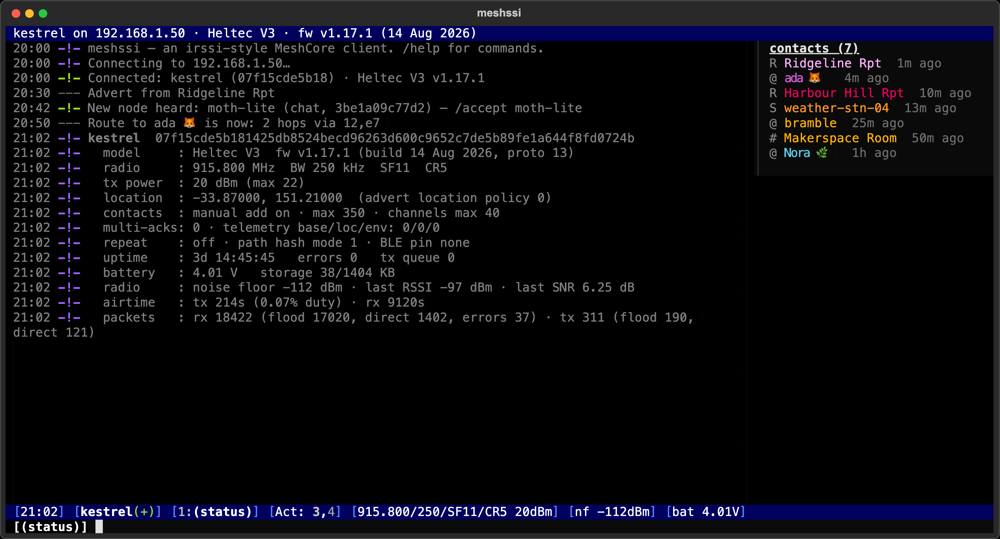

# meshssi

An irssi-style terminal client for [MeshCore](https://github.com/meshcore-dev/MeshCore) companion radios: channel and DM chat, plus device and repeater maintenance.


| Direct messages with delivery acks | Repeater admin (`/login`, `/rcmd`, `/rstatus`) | Device maintenance (`/info`, `/stats`) |
|---|---|---|
|  |  |  |

<sub>Screenshots use made-up nodes and data; regenerate them with `.venv/bin/python scripts/screenshots.py`.</sub>

```
meshssi 192.168.1.50            # WiFi companion (TCP, default port 5000)
meshssi /dev/cu.usbmodem1101    # USB serial companion
meshssi                         # reuse the last target
```

Install: `python3 -m venv .venv && .venv/bin/pip install -e .` then run `./meshssi.sh` (or `.venv/bin/meshssi`).

`meshssi.sh` doesn't rely on the editable install's `.pth` file. On macOS, iCloud-synced folders like
`~/Documents` can get the "hidden" file flag, and Python 3.13+ skips hidden `.pth` files, which breaks
`.venv/bin/meshssi` with `No module named 'meshssi'`. `chflags -R nohidden .venv` fixes that until the flag comes back.

> WiFi companions serve **one client at a time**. If a phone app or Home Assistant is connected, the two
> keep kicking each other off. meshssi detects this and stops reconnecting; free the radio, then `/reconnect`.

## Layout

- **Topic bar** shows the current window: channel slot, hash, and speakers; or a contact's type, route, and last advert.
- **Scrollback** has irssi-style lines. Hops and SNR are shown dimmed; your DMs show `…` / `✓` / `✗` for delivery acks.
- **Nicklist** (F2 toggles it) shows who's been heard in a channel, contact details in a DM, or all contacts in the status window.
- **Status bar** shows the time, your node, the current window, `Act:` activity (grey = events, white = messages, magenta = DMs and mentions), the radio settings, and the noise floor.

Window 1 is status, followed by one window per channel slot on the radio, then DM windows. Open DMs and all scrollback are saved under `~/.local/share/meshssi/`.

## Keys

| Key | Action |
|---|---|
| alt+1…0, esc then 1…0 | jump to window |
| ctrl+n / ctrl+p, alt+→/← | next / previous window |
| ctrl+a, alt+a | jump to the most active window |
| tab | complete commands and names (names can contain spaces and emoji). At line start in a channel it inserts an `@[mention]` |
| ↑ / ↓ | input history |
| PgUp / PgDn | scroll |

## Commands

Run `/help`, or `/help <cmd>`, inside the app. Summary:

- **chat**: `/msg`, `/query`, `/join #hashtag` (or `/join name <hexkey>`), `/part`, `/channels`, `/key`. Long messages are split automatically to fit the packet size.
- **contacts**: `/contacts`, `/whois`, `/pending`, `/accept`, `/rmcontact`, `/resetpath`, `/discover`, `/share`
- **remote** (repeaters, rooms, sensors): `/login`, `/logout`, `/rcmd <node> <cli cmd>`, `/rstatus`, `/telemetry`, `/neighbours`
- **device**: `/info`, `/stats`, `/time [sync]`, `/advert [flood]`, `/nick`, `/txpower`, `/radio`, `/coords`, `/set`, `/cli`, `/refresh`, `/reboot`
- **client**: `/window`, `/wc`, `/clear`, `/reconnect [host]`, `/quit`

Destructive commands (`/reboot`, `/radio`, `/rmcontact`, parting Public) only run if you repeat them within 10 seconds.
