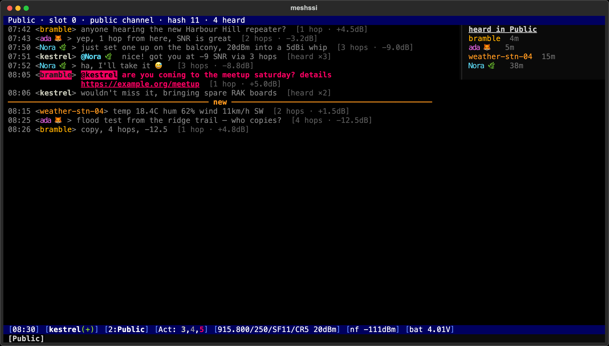
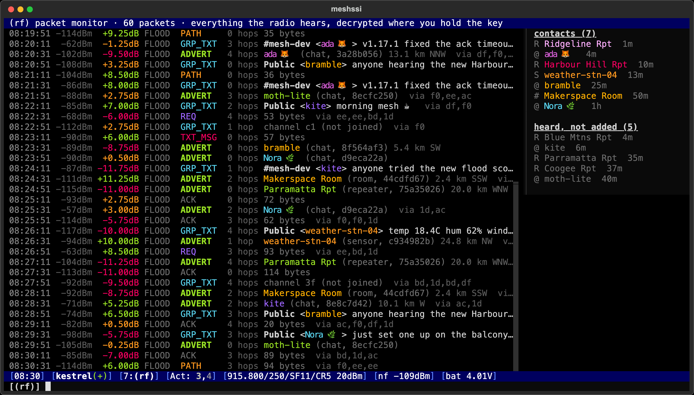
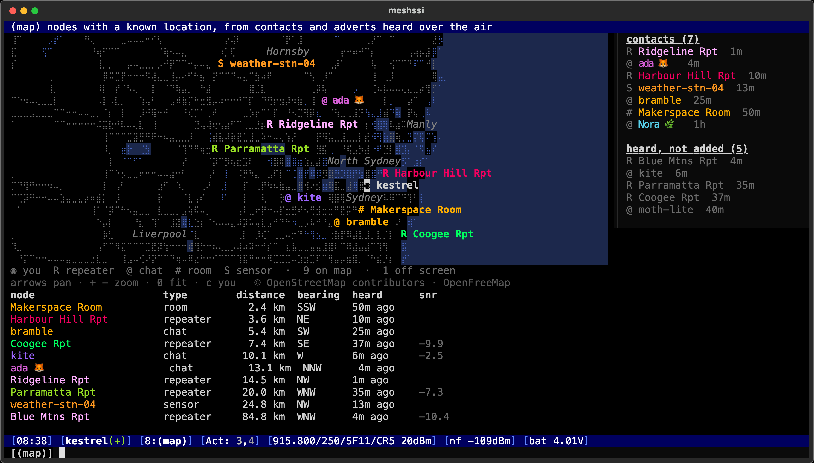
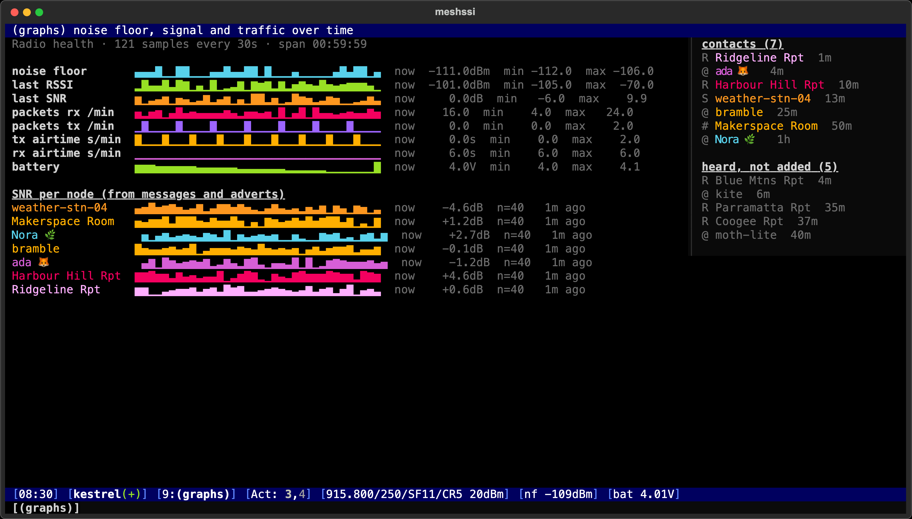
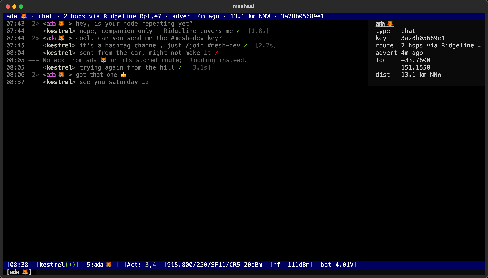
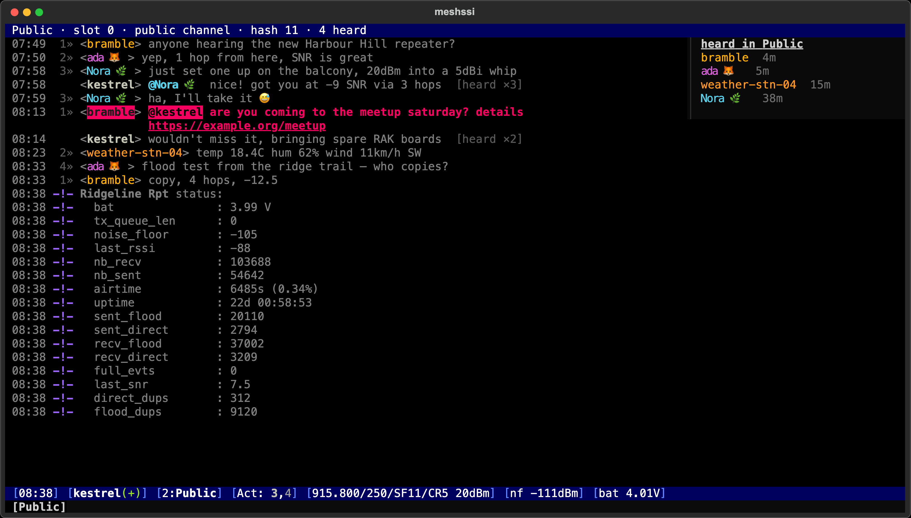
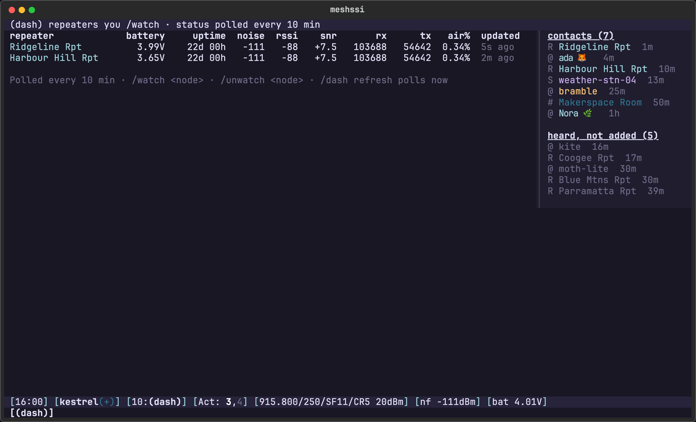
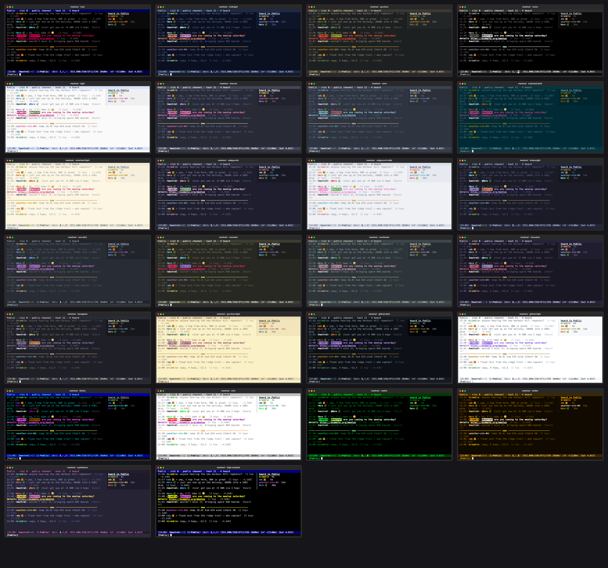

# meshssi

An irssi-style terminal client for [MeshCore](https://github.com/meshcore-dev/MeshCore) companion radios. Use it to chat on channels and in DMs, watch every packet your radio hears, map the mesh, trace routes hop by hop, and administer your radio and repeaters, all from the keyboard.



| Live packet monitor | Mesh map | Signal graphs |
|---|---|---|
|  |  |  |
| **DMs with retries and delivery acks** | **Repeater admin** | **Repeater dashboard** |
|  |  |  |

<sub>Screenshots are from `meshssi --demo`, a simulated mesh with made-up nodes. `scripts/screenshots.py` regenerates them.</sub>

## Install

macOS and Linux:

```sh
curl -fsSL https://github.com/dmellok/meshssi/releases/latest/download/install.sh | sh
```

This puts `meshssi` on your PATH in its own isolated environment, using [uv](https://docs.astral.sh/uv/) or pipx; if you have neither, it installs uv first. Re-run it to update; `uv tool uninstall meshssi` removes it. It needs Python 3.11+, and uv fetches that for you if needed.

Or install it directly: `uv tool install git+https://github.com/dmellok/meshssi` (or `pipx install …`).

## Quick start

```sh
meshssi --demo                 # try it without a radio
meshssi 192.168.1.50           # WiFi companion (TCP, port 5000 by default)
meshssi /dev/cu.usbmodem1101   # USB serial companion
meshssi --scan                 # find Bluetooth radios, then: meshssi ble:<address>
meshssi                        # reconnect to the last radio
```

Working on meshssi itself? `git clone`, then `python3 -m venv .venv && .venv/bin/pip install -e ".[dev]"`, and run `./meshssi.sh`. See [Development](#development), and [Troubleshooting](#troubleshooting) if `.venv/bin/meshssi` can't find its module on macOS.

## What it does

**Chat like irssi.** Window 1 is status, then one window per channel slot on the radio, then DM windows. Tab completes commands, settings and node names. Names can include spaces and emoji: skip the emoji, or type its name (`turtle hops` or `turtle` both find "Turtle Hops 🐢"), and any word of the name works (`hops`). At the start of a channel line, Tab inserts an `@[mention]`. Also included: input history, `/lastlog` search, `/ignore`, `/hilight`, `/away` with a single auto-reply per person, `/alias`, `/split` to watch two windows at once, and an unread marker line. URLs are clickable, and `:shortcodes:` become emoji. Scrollback is saved, and open DMs are restored on restart.

**Composing.** Long messages wrap onto more input lines as you type. A counter beside the input shows bytes used against the packet limit, turning yellow then red as you approach it, and `· 2 msgs` when a message will be split into several packets.

**Reliable DMs.** Each DM shows `…` while pending, `✓` when acked (with round-trip time) and `✗` if it failed. Missing acks trigger automatic retries, falling back to flood routing after `chat.flood_after` tries. If an ack arrives after meshssi gave up, the ✗ turns into ✓. Long messages are split to fit the packet size.

**See the mesh.** `/rf` is a live packet monitor showing every packet the radio hears: RSSI, SNR, route, type and path. Hops are named when they're unambiguous, and channel traffic is decrypted where you hold the key. Every advert heard feeds a registry of nodes, whether or not they're your contacts, which powers:
- the map (`/map`): nodes over an OpenStreetMap background drawn in braille (coastline, water, roads, suburb names), with distances and bearings from you. Pan with the arrow keys and zoom with `+` / `-` while the input is empty.
- `/heard`: every node heard, contact or not
- names in paths and room posts
- tab completion

Channel messages you send show **heard ×N** as repeaters relay them back to you. `/graphs` plots noise floor, RSSI/SNR, traffic, airtime, battery, and SNR per node over time.

**Routes.** Click the hop count next to any message (e.g. `2»`) to see the repeaters it came through, by name, and trace that route. `/trace` sends a trace along a route and shows the SNR at every hop. `/path` runs path discovery. `/discover` asks nearby nodes to identify themselves. `/scope` limits floods to a region.

**Administer repeaters and rooms.** Log in, then run CLI commands with `/rcmd`; replies appear in the node's window. Also: `/rstatus`, `/neighbours` (named from what you've heard), `/telemetry`, `/acl` and `/setperm`, `/owner`, `/regions`. `/watch` adds repeaters to a dashboard (`/dash`) that polls their battery, uptime, noise and airtime on a schedule. `/room` logs into room servers, shows posts by author, and can save the password for auto-login.

**Maintain your radio.** Commands for:
- identity and settings: `/info`, `/stats`, `/time sync` (also automatic on connect), `/nick`, `/txpower`, `/coords`
- radio parameters: `/radio` with regional presets
- scheduled adverts: `/advert every 30`
- low-level tuning: `/tuning`, `/vars`, `/pin`, `/cli`
- contacts: `/uri` and `/qr` to share (scannable by the phone app), `/import` / `/export` for all contacts and channel keys
- identity backup: `/keybackup` / `/keyrestore`
- firmware: `/fwcheck` compares against the latest MeshCore release
- `/factoryreset`, guarded behind typing the node's name

**Share one radio between apps.** See [daemon mode](#daemon-mode-share-the-radio).

**Themes and settings.** There are 26 [themes](#themes), and everything is configurable in `~/.config/meshssi/config.toml` or with `/set`. Desktop notifications for DMs and mentions (macOS and Linux) appear when the terminal isn't focused.

**Plugins.** Drop Python files into `~/.config/meshssi/plugins/` to add bots, bridges and commands (see [Plugins](#plugins)).

## Keys

| Key | Action |
|---|---|
| alt+1…0, or esc then 1…0 | jump to window |
| ctrl+n / ctrl+p, alt+→/← | next / previous window |
| ctrl+a, alt+a | jump to the most active window (DMs and mentions first) |
| tab | complete; press again to cycle |
| ↑ / ↓ | input history (or move between lines when a long message wraps) |
| PgUp / PgDn | scroll |
| F2 | toggle the nicklist |

In the status bar, `Act:` lists windows with unread activity: grey for events, white for messages, magenta for DMs and mentions. A line starting with `//` sends a message that begins with `/`.

## Themes



`/theme` lists every theme with a live swatch. `/theme <name>` switches, and `/theme next` / `/theme prev` flip through them. The choice is saved to `ui.theme`.

- **Classic:** `irssi` (the default), `bitchx`, `mirc`, `mono`, `high-contrast`
- **Dark:** `midnight`, `dracula`, `nord`, `solarized-dark`, `catppuccin`, `tokyonight`, `one-dark`, `monokai`, `gruvbox`, `everforest`, `rose-pine`, `kanagawa`, `github-dark`, `synthwave`
- **Light:** `light`, `solarized-light`, `catppuccin-latte`, `gruvbox-light`, `github-light`
- **CRT:** `matrix`, `amber`

Themes live in [`meshssi/themes.py`](meshssi/themes.py). A new one is usually a single `palette(...)` call with a background, a foreground, the bar colours and seven accents; the rest (graphs, packet types, signal quality) is derived. `scripts/theme_gallery.py` re-renders the image above.

## Commands

`/help` lists these in the app, and `/help <command>` or `/help <category>` narrows it down. Commands that need a node take its name; Tab completes it, and a unique prefix, a word from the name, or a key prefix works too. Emoji in names can be left out or typed by name (🐢 is `turtle`).

**Chat**

| Command | What it does |
|---|---|
| `/away [message]` | Mark yourself away; DMs get one auto-reply each. No message = back |
| `/back` | Clear away status |
| `/channels` | List channels configured on the radio (also `/list`) |
| `/hilight [-del] [word]` | Words that highlight channel lines; no argument lists them (also `/highlight`) |
| `/ignore [nick-pattern]` | Hide messages from a nick (globs ok); no argument lists them |
| `/join <#hashtag> \| <name> <32-hex-key>` | Add a channel to a free slot on the radio |
| `/key [#channel]` | Show a channel's secret key (to share it) |
| `/lastlog [-all] <text>` | Search scrollback (current window, or all with -all) (also `/grep`) |
| `/msg <contact\|#channel> <text>` | Send a message without switching windows (also `/m`) |
| `/part [#channel]` | Remove a channel from the radio (also `/leave`) |
| `/query <contact>` | Open a DM window with a contact (also `/dm`) |
| `/room <room> [password] [-save]` | Log into a room server and open its window; -save auto-logs in on connect |
| `/unignore <nick-pattern>` | Stop ignoring a nick |

**Contacts**

| Command | What it does |
|---|---|
| `/accept <name\|key-prefix\|all>` | Add a pending node to the radio's contacts (also `/add`) |
| `/autoadd [on\|off]` | Whether new nodes are added automatically (off = /pending + /accept) |
| `/contacts [filter]` | List contacts stored on the radio (also `/who`, `/names`) |
| `/export <file.json>` | Save all contacts (as cards) and channels (with keys) to a file |
| `/fav <contact>` | Toggle a contact's favourite flag (protects it from being dropped) |
| `/import <meshcore://… \| file.json>` | Add a contact from a card URI, or contacts+channels from an /export file |
| `/path <contact>` | Discover a route to a contact and back (path discovery) (also `/ping`, `/pathfind`) |
| `/pending` | Nodes heard but not yet added (your radio is in manual-add mode) |
| `/qr [contact]` | Show a scannable QR code of a contact card (or your own) for the phone app |
| `/resetpath <contact>` | Forget the stored route; the next message floods |
| `/rmcontact <contact>` | Delete a contact from the radio |
| `/share <contact>` | Re-broadcast a contact's advert zero-hop so neighbours learn it |
| `/uri [contact]` | Show a meshcore:// card for a contact, or for yourself |
| `/whois <contact>` | Show everything known about a node (also `/wi`) |

**The mesh**

| Command | What it does |
|---|---|
| `/discover [chat\|repeater\|room\|sensor…]` | Ask nearby nodes to identify themselves (zero-hop) |
| `/graphs` | Noise floor, signal, traffic and per-node SNR over time (also `/signal`) |
| `/heard [filter]` | Every node heard over the air this session and before, contacts or not |
| `/map [in\|out\|fit\|center <node>\|basemap on\|off\|style braille\|dots\|cache]` | Map of nodes over OpenStreetMap, with distance and bearing from you (arrows pan, +/- zoom) |
| `/rf [clear\|stats]` | Open the live packet monitor: every packet the radio hears (also `/monitor`, `/sniff`) |
| `/scope [region\|*\|off] [-default]` | Flood scope: limit floods to a region (-default saves it on the radio) |
| `/trace <node \| hash,hash,...>` | Trace a route, showing the SNR at every hop |

**Remote nodes (repeaters, rooms, sensors)**

| Command | What it does |
|---|---|
| `/acl <repeater\|room>` | List who has access to a node (you must be admin) |
| `/dash [refresh]` | Open the repeater dashboard; refresh polls every watched repeater now |
| `/login <node> [password]` | Log into a repeater or room (blank password = guest) |
| `/logout <node>` | Log out of a repeater or room |
| `/neighbours <repeater>` | A repeater's neighbours, with the SNR it hears them at (also `/neighbors`, `/nb`) |
| `/owner <node>` | Ask a node for its owner info (no login needed) |
| `/rcmd <node> <cli command>` | Run a CLI command on a repeater (log in first); the reply shows in its window (also `/rc`) |
| `/regions <node>` | Ask a repeater which flood-scope regions it serves |
| `/rstatus <node>` | Request status (uptime, battery, airtime, counters) from a node (also `/status`) |
| `/setperm <node> <contact\|key> <guest\|read-only\|read-write\|admin>` | Change a user's permission on a repeater/room |
| `/telemetry [node]` | Sensor telemetry from a node (no node = this radio) (also `/tele`) |
| `/unwatch <repeater>` | Remove a repeater from the dashboard |
| `/watch <repeater>` | Add a repeater to the (dash) dashboard; its status is polled over the mesh |

**This radio**

| Command | What it does |
|---|---|
| `/advert [flood] \| /advert every <minutes\|off>` | Send an advert now, or schedule them |
| `/cli <command>` | Run a raw firmware CLI command on this radio |
| `/coords <lat> <lon> \| /coords share on\|off` | Set this node's location, or whether adverts include it |
| `/factoryreset <node name>` | Erase everything on the radio (type its exact name, twice) |
| `/fwcheck` | Compare the radio's firmware with the latest MeshCore companion release (asks GitHub) |
| `/info` | Radio identity, firmware and settings (also `/sysinfo`) |
| `/keybackup <file>` | Save this node's private key (identity) to a file — keep it secret |
| `/keyrestore <file>` | Load a private key from /keybackup onto this radio (replaces its identity) |
| `/nick <name>` | Change this node's advertised name (also `/name`) |
| `/pin <6 digits\|0>` | Set the Bluetooth pairing PIN (0 = random each boot) |
| `/radio <MHz> <bw kHz> <sf> <cr> \| /radio preset <name>` | Set LoRa parameters (must match your mesh!) |
| `/reboot` | Reboot the radio (asks for confirmation) |
| `/refresh` | Reload identity, contacts and channels from the radio (also `/rehash`) |
| `/stats` | Uptime, battery, storage, noise floor, airtime and packet counters (also `/battery`, `/bat`) |
| `/time [sync]` | Show the radio clock, or set it from this computer |
| `/tuning [rx_delay airtime_factor]` | Show or set the radio's rx delay and airtime factor |
| `/txpower <dBm>` | Set transmit power |
| `/vars [name value]` | Firmware custom variables (e.g. GPS, sensors) |

**Client**

| Command | What it does |
|---|---|
| `/alias [name [/command args...]]` | Define a shortcut ($* = the arguments); no args lists them |
| `/clear` | Clear the current window's scrollback on screen |
| `/help [command\|category]` | List commands, or show help for one |
| `/notify [on\|off\|test]` | Desktop notifications for DMs and mentions |
| `/plugins` | List loaded plugins and their commands |
| `/quit` | Exit meshssi (also `/exit`) |
| `/reconnect [target]` | Reconnect, optionally to another radio (host[:port], /dev/..., ble:ADDR) (also `/connect`, `/server`) |
| `/set [section.key [value]] \| /set <device-setting> <value>` | Show or change settings (config.toml); device settings: manualadd, multiacks, locpolicy, pathhash, autoadd |
| `/split [n\|off]` | Show another window's scrollback above this one |
| `/theme [name\|next\|prev]` | Switch colour theme; no argument shows them all |
| `/unalias <name>` | Remove an alias |
| `/wc` | Close the current window (use /part to leave a channel) (also `/close`) |
| `/window <n>\|close\|list\|move <n>` | Switch, close, list or reorder windows (also `/win`, `/w`) |

Commands that are hard to undo only run if you repeat them within 10 seconds: `/reboot`, `/radio`, `/rmcontact`, `/keybackup`, `/keyrestore`, `/factoryreset` (which also needs the node's name), `/setperm`, and parting Public. The prompt says exactly what will happen, e.g. "make Drop Bear 🐨 (a1b2c3d4e5f6) ADMIN on Big Stick Rpt". `/setperm` also only accepts an exact contact name or a full key (a prefix only when removing someone), so a typo can't resolve to someone else. `/rcmd` sends raw CLI commands to a repeater unchecked; that's its purpose.

## Daemon mode: share the radio

A MeshCore WiFi companion serves **one client at a time**: when a phone app, Home Assistant or a second meshssi connects, the first one gets dropped. `--serve` holds that single connection and re-serves the same companion protocol on a local port, so any number of clients can share the radio:

```sh
./meshssi.sh --serve 192.168.1.50            # listens on 127.0.0.1:5001 (daemon.listen in config)
./meshssi.sh 127.0.0.1:5001                  # as many clients as you like, including other apps
./meshssi.sh --serve --listen 0.0.0.0:5001 192.168.1.50   # let other machines (e.g. Home Assistant) connect too
```

**Anyone who can connect to the daemon's port has full control of your radio**, including exporting its private key, because the companion protocol has no login. Keep the default `127.0.0.1`, and only use `0.0.0.0` on a network you trust.

Requests are serialised, and each reply goes back to the client that asked. Pushes (adverts, packet log, acks) go to everyone. The daemon fetches incoming messages itself and keeps them in a shared log, and each client reads its own copy, so no client steals another's messages. A client that reconnects under the same app name resumes where it left off, including messages that arrived while it was away. Serial and Bluetooth radios work as the upstream too.

To keep it running on macOS, run it in `tmux`/`screen`, or as a LaunchAgent that runs `/path/to/meshssi/meshssi.sh --serve <radio>` with `KeepAlive` set to true.

## The map

`/map` draws your nodes over an OpenStreetMap background: water and coastline, roads (more detail as you zoom in), parks and place names, in your theme's colours. While the map is showing and the input line is empty, the arrow keys pan, `+` / `-` zoom, `0` fits everything back in, and `c` centres on you. Far-off outliers (the odd 500 km contact) stay in the table below the map so the local mesh fills the screen.

Map data is © OpenStreetMap contributors, served as vector tiles by [OpenFreeMap](https://openfreemap.org) (no account or key). Tiles are cached in `~/.cache/meshssi/tiles/`, so areas you've looked at keep working offline. `/map cache` shows how much is stored.

It degrades gracefully:
- **Offline:** you get cached areas, and elsewhere just the nodes on a plain background.
- **Bad data:** a tile that won't download or decode is left out and retried later.
- **Missing braille in your font:** `/map style dots` draws plain dots instead.
- **Opting out:** `/map basemap off` turns the background off entirely.
- **Other tile sources:** `map.tiles` in the config accepts any OpenMapTiles-schema TileJSON URL or `{z}/{x}/{y}.pbf` template.

## Configuration

`~/.config/meshssi/config.toml` is created on first run with every setting and its default. Change settings there or live with `/set section.key value`; `/set` alone lists everything, and `/set key -default` resets one. Highlights:

| Setting | Default | |
|---|---|---|
| `ui.theme` | `irssi` | or `/theme` |
| `ui.show_hops` / `ui.show_snr` | on / off | hop-count column before each nick (`2»` = two hops, green `0»` = direct); SNR tag after received messages |
| `ui.show_signal` / `ui.show_paths` | on / off | heard-by and round-trip tags on your messages; repeater path on channel lines |
| `chat.dm_retries` / `chat.flood_after` | 3 / 2 | DM delivery attempts, and when to switch to flooding |
| `chat.highlights`, `chat.ignores` | `[]` | or `/hilight`, `/ignore` |
| `notify.desktop` / `notify.only_when_unfocused` | on / on | or `/notify` |
| `device.auto_time_sync` | on | fix the radio clock on connect |
| `device.advert_interval` | 0 | minutes between automatic adverts, or `/advert every N` |
| `dashboard.interval` / `dashboard.watch` | 10 / `[]` | repeater polling (each poll transmits) |
| `map.basemap` / `map.style` / `map.tiles` | on / braille / OpenFreeMap | the OpenStreetMap background (see [The map](#the-map)) |
| `[rooms]` | | room name = password, for auto-login (`/room … -save`) |
| `[aliases]` | `j`, `ll`, `wii` | or `/alias` |
| `[radio_presets]` | au, eu, nz, us… | used by `/radio preset`. Check them against your local mesh before switching. |

Scrollback and state live in `~/.local/share/meshssi/<node key>/`.

## Plugins

A plugin is a Python file in `~/.config/meshssi/plugins/` with a `setup(api)` function:

```python
def setup(api):
    @api.on("dm")                       # also: channel_message, sent, packet, advert, connect
    async def ping(win, rec, contact):
        if rec["text"].strip() == "!ping":
            await api.reply(win, f"pong ({rec.get('hops')} hops, {rec.get('snr')} dB)")

    @api.command("hello", "Greet the current window")
    async def hello(args):
        await api.say(api.current_window, f"hello {args}")
```

`api.say(target, text)` sends to a window, a channel name or a contact. `api.echo()` writes to the status window. `api.config` holds the plugin's `[plugin.<name>]` settings, and `api.radio(fn, …)` runs any `meshcore` command safely. Working examples are in [`examples/plugins`](examples/plugins):
- `pingbot`: range-test replies
- `webhook`: forward messages and adverts to Home Assistant or any URL
- `keywords`: log alert words to a file

## Troubleshooting

- **"The radio keeps dropping us"**: another client is connected to the WiFi companion. Close it, or use [daemon mode](#daemon-mode-share-the-radio).
- **`No module named 'meshssi'` from `.venv/bin/meshssi` on macOS**: iCloud-synced folders like `~/Documents` can set the hidden flag on the venv's `.pth` file, and Python 3.13+ skips hidden `.pth` files. Use `./meshssi.sh`, or run `chflags -R nohidden .venv`.
- **Nothing in `/rf`**: the packet monitor shows what the radio reports. On a quiet mesh that can be a few packets a minute.
- `--debug` writes a protocol log to `meshssi-debug.log`.

## Development

```sh
.venv/bin/pip install -e ".[dev]"
.venv/bin/pytest -q                       # unit tests, the daemon against a fake radio, and the full UI against the demo mesh
.venv/bin/python scripts/screenshots.py   # regenerate docs/*.png (needs Chrome)
```

`meshssi/demo.py` simulates a radio and mesh that runs through the app's real code paths (acks, retries, traces, the packet log), so most features can be worked on without hardware.

## License

meshssi is free software under the [GNU Affero General Public License v3.0](LICENSE) or later. You can use, modify and share it; if you distribute a modified version, or run one as a network service, you must make its source available under the same licence.
